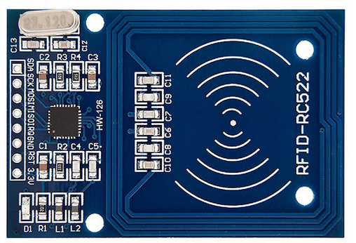
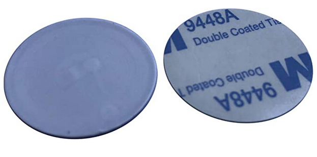
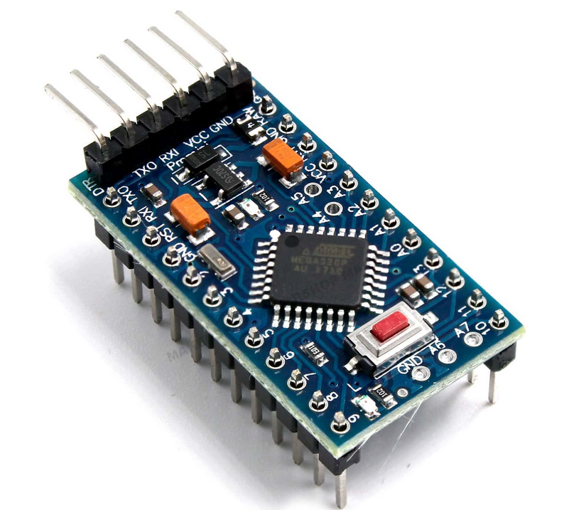
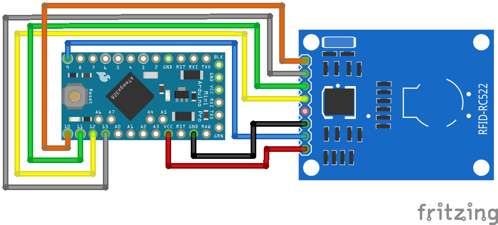

Bei den RFID-RC522 muss man C8 und c8 durch 120pF Kondensatoren ersetzen um eine viel bessere Reichweite zu erreichen.
Wenn man dann unten den Tags noch eine 1,5mm GFK Scheibe legt gehen bei mir die 23mm ONMETALL problemlos.

## MFRC-522

Dieses RFID-Modul erlaubt das Auslesen und Beschreiben von RFID-Tags und ist sowohl für Einplatinen-Computer wie Raspberry Pi als auch für Einplatinen-Mikrocontroller wie Arduino einsetzbar.

• RFID-Modul mit integrierten NXP MFRC-522
• 13,56 MHz Frequenz
• Kommunikation über SPI
• basierend auf dem Mifare Protokoll
• erlaubt das Auslesen und Beschreiben von RFID-Tags

### RFID-Tags

NFC Aufkleber RFID anti-metal auf Metall Tag Label MIFARE Classic® 1K 13,56MHz Dia 25mm

The tag is a Mifare transponder with 1 KB of memory which is divided into 16 sectors, each sector into 4 blocks and each block can store 2 bytes of data. Each sector has two keys (A/B) which can be assigned with rights for reading and writing memory blocks. The last block contains the keys and the rights (access conditions).

The sectors are numbered from 0 to 15 and the block number for every block (containing 2 bytes) is serially numbered from 0 to 63.

The Mifare classic has a proprietary “Crypto-1” algorithm which is not secure anymore since 2008. There are newer MIFARE DESFire EV1 and EV2 tags which are secure until today. But for some DIY projects the security is in my case not so important.

# Arduino Pro Mini 3,3V, 8MHz

# Verdrahtung
## RC522

| RC522 RFID Reader | Arduino Nano, Pro Mini 3.3V, Uno |
|-------------------|----------------------------------|
| SDA               | 10                               |
| SCK               | 13                               |
| MOSI              | 11                               |
| MISO              | 12                               |
| IRQ               | not connected                    |
| GND               | GND                              |
| RST               | 9                                |
| 3.3V              | 3V3                              |

## BID
| Signal | BID   | ProMini  |
|--------|-------|----------|
| GND    | Black | GND      |
| SCK    | Green | A4       |
| SCL    | White | A5       |
| VCC    | Orange| not conn.|

## LED

| Signal | LED         | ProMini |
|--------|-------------|---------|
| GND    | K           | GND     |
| LED    | A (330 Ohm) | A1      |

# Links
* [https://diyi0t.com/rfid-sensor-tutorial-for-arduino-and-esp8266/](https://diyi0t.com/rfid-sensor-tutorial-for-arduino-and-esp8266/)
* [https://onki.de/uebermich/bauberichte/288-bid2nfc-drahtlos-bid-chip-fuer-robbe-lader](https://onki.de/uebermich/bauberichte/288-bid2nfc-drahtlos-bid-chip-fuer-robbe-lader)
* [https://onki.de/uebermich/bauberichte/289-bid2nfc-einbau-ins-ladegeraet](https://onki.de/uebermich/bauberichte/289-bid2nfc-einbau-ins-ladegeraet)

